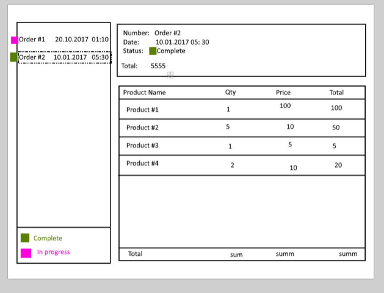

# TestTask_Roxosoft

Необходимо разработать приложение, показывающую список заказов и детали по конкретному заказу. Шаблон интерфейса во вложении.
- в левой стороне отображается список заказов. Должна быть возможность кликнуть по любому из них.
- при клике на заказ справа показываются детали по заказу.
- данные должны получаться с сервера.

На клиенте использовать ASP.NET MVC Core или WPF.
Бэкенд - ASP.NET Web Core API или WCF. Данные можно захардкодить, плюсом будет сделать базу и показать владение EntityFramework.

